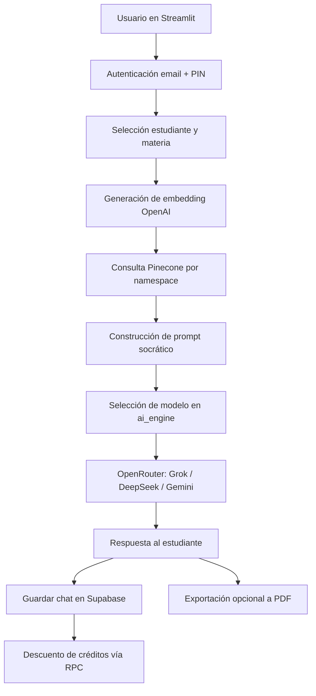

# Arquitectura y flujo

## Diagrama (Mermaid)

## Flujo de alto nivel

1. La UI en Streamlit recibe pregunta, materia e imagen opcional.
2. `core/rag_search.py` crea embedding con OpenAI y consulta Pinecone por materia.
3. `core/ai_engine.py` construye prompt con contexto y define el modelo ideal.
4. OpenRouter devuelve la respuesta con enfoque socrático.
5. `core/database.py` persiste el historial y descuenta créditos.
6. `core/pdf_generator.py` permite exportar la conversación.

## Componentes principales

- UI: [app.py](https://github.com/Idromerom714/Tutor-Icfes-AI/blob/main/app.py)
- Registro: [pages/registro.py](https://github.com/Idromerom714/Tutor-Icfes-AI/blob/main/pages/registro.py)
- IA: [core/ai_engine.py](https://github.com/Idromerom714/Tutor-Icfes-AI/blob/main/core/ai_engine.py)
- RAG: [core/rag_search.py](https://github.com/Idromerom714/Tutor-Icfes-AI/blob/main/core/rag_search.py)
- DB: [core/database.py](https://github.com/Idromerom714/Tutor-Icfes-AI/blob/main/core/database.py)
- Auth: [core/auth.py](https://github.com/Idromerom714/Tutor-Icfes-AI/blob/main/core/auth.py)
- PDF: [core/pdf_generator.py](https://github.com/Idromerom714/Tutor-Icfes-AI/blob/main/core/pdf_generator.py)

## Estado de sesión relevante

- `st.session_state.autenticado`: login válido.
- `st.session_state.email_padre`: cuenta activa del tutor.
- `st.session_state.estudiante_actual`: estudiante seleccionado.
- `st.session_state.messages`: mensajes del chat activo.

## Materias y namespaces de Pinecone

Las materias deben mapearse de forma consistente a namespaces:

- `matematicas`
- `fisica`
- `sociales`
- `lectura_critica`
- `ingles`

Mantener esta convención en ingesta (`upload_pdfs.py`) y en consulta evita pérdida de contexto en RAG.

## Decisiones técnicas clave

- Cliente dual de Supabase: clave pública para flujo normal y `SUPABASE_SERVICE_KEY` para operaciones administrativas.
- Selección dinámica de modelo por tipo de consulta/materia.
- Persistencia de historial como JSON para reconstrucción de sesión.
