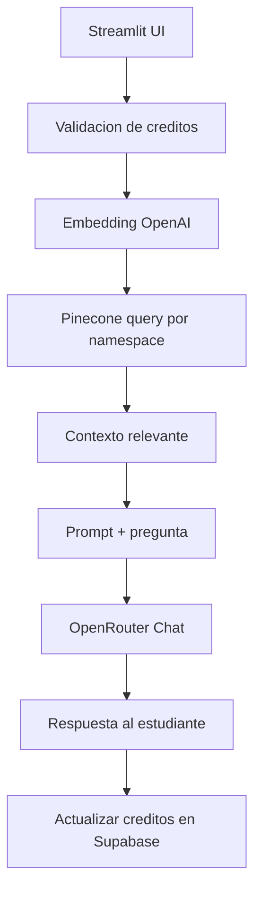

# Arquitectura y flujo

## Diagrama (Mermaid)

## Diagrama de alto nivel (texto)
1. Streamlit recibe la pregunta y la materia.
2. Se genera embedding con OpenAI.
3. Se consulta Pinecone con `namespace` por materia.
4. Se arma el prompt con contexto + pregunta.
5. OpenRouter responde con el modelo configurado.
6. Se guarda historial y se descuentan creditos.

## Componentes
- UI: [app.py](../../app.py)
- IA: [core/ai_engine.py](../../core/ai_engine.py)
- RAG: [core/rag_search.py](../../core/rag_search.py)
- DB: [core/database.py](../../core/database.py)

## Datos y estados
- `st.session_state.autenticado`: estado de login.
- `st.session_state.user`: perfil del estudiante.
- `st.session_state.messages`: historial de chat.

## Materias y namespaces
Las materias se convierten a minusculas y se usan como `namespace`:
- matematicas
- lectura critica
- sociales
- ciencias naturales
- ingles

Asegura consistencia al cargar documentos en Pinecone.
